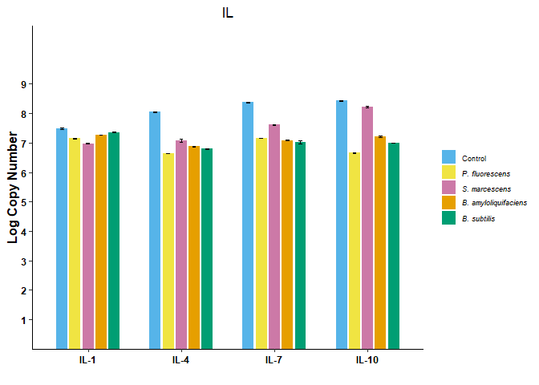
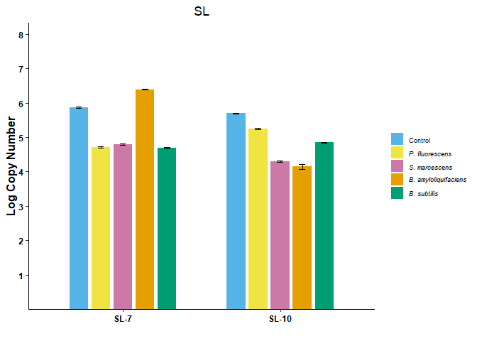
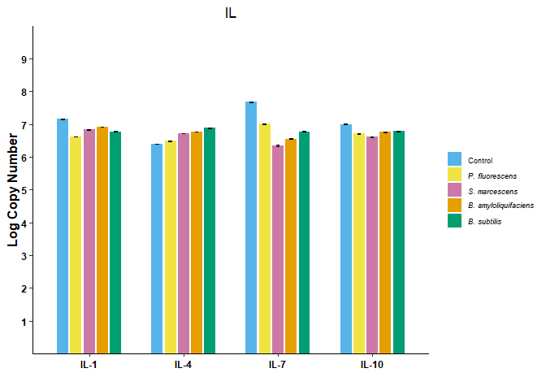
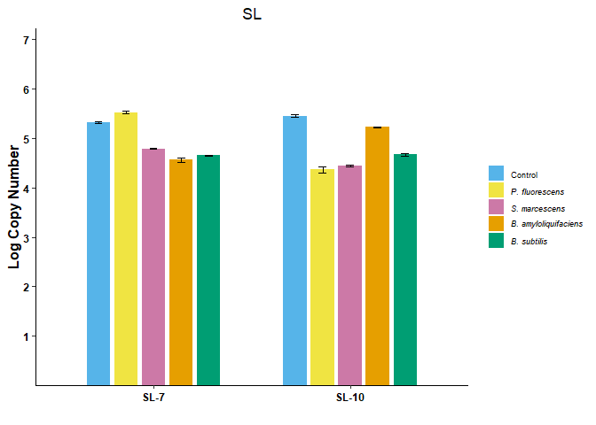
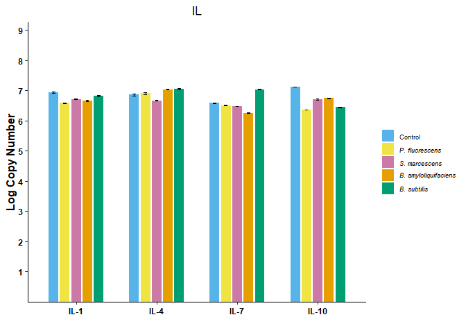
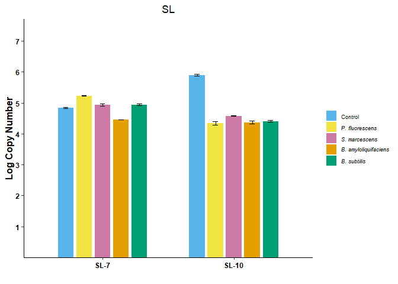

# First trial

\###Libraries used

``` r
library(tidyverse)
```

    ## ── Attaching core tidyverse packages ──────────────────────── tidyverse 2.0.0 ──
    ## ✔ dplyr     1.1.4     ✔ readr     2.1.5
    ## ✔ forcats   1.0.0     ✔ stringr   1.5.1
    ## ✔ ggplot2   3.5.1     ✔ tibble    3.2.1
    ## ✔ lubridate 1.9.4     ✔ tidyr     1.3.1
    ## ✔ purrr     1.0.2     
    ## ── Conflicts ────────────────────────────────────────── tidyverse_conflicts() ──
    ## ✖ dplyr::filter() masks stats::filter()
    ## ✖ dplyr::lag()    masks stats::lag()
    ## ℹ Use the conflicted package (<http://conflicted.r-lib.org/>) to force all conflicts to become errors

``` r
library(ggplot2)
library(agricolae)
library(tidyr)
```

\###Load and verify data of Rep 1

``` r
rep1 <- read.csv("Nb_PGPR+PVY_1st_Reproducibility.csv", header=T)
head(rep1)  # View the first few rows
```

    ##   Treatment  Dpi Replication    Cq
    ## 1   Control IL-1           1 19.72
    ## 2   Control IL-1           2 19.56
    ## 3   Control IL-1           3 19.98
    ## 4   Control IL-4           1 17.55
    ## 5   Control IL-4           2 17.48
    ## 6   Control IL-4           3 17.58

``` r
str(rep1)   # Check the structure of the data
```

    ## 'data.frame':    90 obs. of  4 variables:
    ##  $ Treatment  : chr  "Control" "Control" "Control" "Control" ...
    ##  $ Dpi        : chr  "IL-1" "IL-1" "IL-1" "IL-4" ...
    ##  $ Replication: int  1 2 3 1 2 3 1 2 3 1 ...
    ##  $ Cq         : num  19.7 19.6 20 17.6 17.5 ...

``` r
summary(rep1) # Quick statistical summary
```

    ##   Treatment             Dpi             Replication       Cq       
    ##  Length:90          Length:90          Min.   :1    Min.   :15.98  
    ##  Class :character   Class :character   1st Qu.:1    1st Qu.:20.60  
    ##  Mode  :character   Mode  :character   Median :2    Median :21.72  
    ##                                        Mean   :2    Mean   :23.33  
    ##                                        3rd Qu.:3    3rd Qu.:26.77  
    ##                                        Max.   :3    Max.   :33.18

\###Make the factor variable

``` r
rep1$Treatment<-as.factor(rep1$Treatment)
rep1$Dpi<-as.factor(rep1$Dpi)
```

\###Add a new column ViralLoad

``` r
rep1$ViralLoad<-((10^((rep1$Cq-49.153)/-3.93)))
```

\###Reorder the Treatment and Dpi factor(IL sample only)

``` r
rep1$Treatment <- factor(rep1$Treatment, levels = c("Control", "P. fluorescens", "S. marcescens", "B. amyloliquifaciens", "B. subtilis"))
rep1_IL <- rep1[rep1$Dpi %in% c("IL-1", "IL-4", "IL-7", "IL-10"), ]
```

\####Plot Bar graph

``` r
cbbPalette <- c( "#56B4E9","#F0E442","#CC79A7", "#E69F00", "#009E73")
PVY1_IL<-ggplot(rep1_IL, aes(x =factor(Dpi,levels=c("IL-1", "IL-4", "IL-7", "IL-10")), y = log10(ViralLoad), fill = Treatment)) +
  stat_summary(fun=mean,geom="bar", position = position_dodge(width = 0.7), width = 0.6) +
  stat_summary(fun.data = mean_se, geom="errorbar",width = 0.2, position = position_dodge(width = 0.7)) +
  theme_classic() +
  labs(title= "IL" ,
       x = "",
       y = "Log Copy Number") +
  scale_fill_manual(values=cbbPalette,
                    labels=c("Control",expression(italic("P. fluorescens")), 
                             expression(italic("S. marcescens")),expression(italic("B. amyloliquifaciens")),expression(italic("B. subtilis"))))+
  scale_y_continuous(
    expand = expansion(mult = c(0, 0.3)), breaks = seq(1, 9, by = 1)  # This removes padding at the bottom of the plot
  )+
  theme(legend.position = "right",
        legend.key.size = unit(0.5, "cm"),  # Adjusts the size of the legend keys
        legend.title = element_blank(),  # Adjusts the legend title font size
        legend.text = element_text(size = 7),
        plot.title= element_text(hjust = 0.5), # Center the plot title
        axis.text.x = element_text(color = "black", face="bold"),   # X-axis text color
        axis.text.y = element_text(color = "black", face="bold"),   # Y-axis text color
        axis.title.x = element_text(color = "black"),  # X-axis label color
        axis.title.y = element_text(color = "black", face="bold", size=12),  # Y-axis label color
        axis.line = element_line(color = "black")      # Axis lines color
  )
PVY1_IL
```

<!-- -->

\#Reorder the Treatment factor and DPi (SL only)

``` r
rep1$Treatment <- factor(rep1$Treatment, levels = c("Control", "P. fluorescens", "S. marcescens", "B. amyloliquifaciens", "B. subtilis"))
rep1_SL <- rep1[rep1$Dpi %in% c("SL-7", "SL-10"), ]
```

\####Plot Bar graph

``` r
cbbPalette <- c( "#56B4E9","#F0E442","#CC79A7", "#E69F00", "#009E73")

PVY1_SL<-ggplot(rep1_SL, aes(x =factor(Dpi,levels=c("SL-7", "SL-10")), y = log10(ViralLoad), fill = Treatment)) +
  stat_summary(fun=mean,geom="bar", position = position_dodge(width = 0.7), width = 0.6) +
  stat_summary(fun.data = mean_se, geom="errorbar",width = 0.2, position = position_dodge(width = 0.7)) +
  theme_classic() +
  labs(title= "SL" ,
       x = "",
       y = "Log Copy Number") +
  scale_fill_manual(values=cbbPalette,
                    labels=c("Control",expression(italic("P. fluorescens")), 
                             expression(italic("S. marcescens")),expression(italic("B. amyloliquifaciens")),expression(italic("B. subtilis"))))+
  scale_y_continuous(
    expand = expansion(mult = c(0, 0.3)), breaks = seq(1, 9, by = 1)  # This removes padding at the bottom of the plot
  )+
  theme(legend.position = "right",
        legend.key.size = unit(0.5, "cm"),  # Adjusts the size of the legend keys
        legend.title = element_blank(),  # Adjusts the legend title font size
        legend.text = element_text(size = 7),
        plot.title= element_text(hjust = 0.5), # Center the plot title
        axis.text.x = element_text(color = "black", face="bold"),   # X-axis text color
        axis.text.y = element_text(color = "black", face="bold"),   # Y-axis text color
        axis.title.x = element_text(color = "black"),  # X-axis label color
        axis.title.y = element_text(color = "black", face="bold", size=12),  # Y-axis label color
        axis.line = element_line(color = "black")      # Axis lines color
        
  )
PVY1_SL
```

<!-- -->

\###Loop for subsetting the Dpi and linear modeling

``` r
# Create vector of cytokines to analyze
R1 <- c("IL-1", "IL-4", "IL-7", "IL-10","SL-7","SL-10")

# Loop through cytokines and print model summaries
for (dpi in R1) {
  cat("\nModel Summary for", dpi, ":\n")
  
  rep1 %>%
    filter(Dpi == dpi) %>%
    lm(log10(ViralLoad) ~ Treatment + Replication, data = .) %>%
    summary() %>%
    print()
}
```

    ## 
    ## Model Summary for IL-1 :
    ## 
    ## Call:
    ## lm(formula = log10(ViralLoad) ~ Treatment + Replication, data = .)
    ## 
    ## Residuals:
    ##       Min        1Q    Median        3Q       Max 
    ## -0.042409 -0.008058 -0.000848  0.008906  0.049194 
    ## 
    ## Coefficients:
    ##                                Estimate Std. Error t value Pr(>|t|)    
    ## (Intercept)                    7.511366   0.021838 343.952  < 2e-16 ***
    ## TreatmentP. fluorescens       -0.329092   0.020822 -15.805 7.16e-08 ***
    ## TreatmentS. marcescens        -0.508058   0.020822 -24.400 1.56e-09 ***
    ## TreatmentB. amyloliquifaciens -0.212892   0.020822 -10.224 2.97e-06 ***
    ## TreatmentB. subtilis          -0.122137   0.020822  -5.866 0.000239 ***
    ## Replication                   -0.015267   0.008064  -1.893 0.090876 .  
    ## ---
    ## Signif. codes:  0 '***' 0.001 '**' 0.01 '*' 0.05 '.' 0.1 ' ' 1
    ## 
    ## Residual standard error: 0.0255 on 9 degrees of freedom
    ## Multiple R-squared:  0.9874, Adjusted R-squared:  0.9804 
    ## F-statistic: 140.8 on 5 and 9 DF,  p-value: 2.903e-08
    ## 
    ## 
    ## Model Summary for IL-4 :
    ## 
    ## Call:
    ## lm(formula = log10(ViralLoad) ~ Treatment + Replication, data = .)
    ## 
    ## Residuals:
    ##       Min        1Q    Median        3Q       Max 
    ## -0.067515 -0.006785  0.001357  0.015437  0.035284 
    ## 
    ## Coefficients:
    ##                               Estimate Std. Error t value Pr(>|t|)    
    ## (Intercept)                    8.09983    0.02866 282.621  < 2e-16 ***
    ## TreatmentP. fluorescens       -1.40712    0.02733 -51.494 1.97e-12 ***
    ## TreatmentS. marcescens        -0.96947    0.02733 -35.478 5.55e-11 ***
    ## TreatmentB. amyloliquifaciens -1.17218    0.02733 -42.896 1.01e-11 ***
    ## TreatmentB. subtilis          -1.25360    0.02733 -45.876 5.56e-12 ***
    ## Replication                   -0.02748    0.01058  -2.597   0.0289 *  
    ## ---
    ## Signif. codes:  0 '***' 0.001 '**' 0.01 '*' 0.05 '.' 0.1 ' ' 1
    ## 
    ## Residual standard error: 0.03347 on 9 degrees of freedom
    ## Multiple R-squared:  0.9973, Adjusted R-squared:  0.9958 
    ## F-statistic: 672.5 on 5 and 9 DF,  p-value: 2.706e-11
    ## 
    ## 
    ## Model Summary for IL-7 :
    ## 
    ## Call:
    ## lm(formula = log10(ViralLoad) ~ Treatment + Replication, data = .)
    ## 
    ## Residuals:
    ##       Min        1Q    Median        3Q       Max 
    ## -0.081425 -0.012723 -0.003393  0.010178  0.089059 
    ## 
    ## Coefficients:
    ##                               Estimate Std. Error t value Pr(>|t|)    
    ## (Intercept)                    8.34767    0.03843 217.195  < 2e-16 ***
    ## TreatmentP. fluorescens       -1.22222    0.03665 -33.353 9.65e-11 ***
    ## TreatmentS. marcescens        -0.76336    0.03665 -20.831 6.34e-09 ***
    ## TreatmentB. amyloliquifaciens -1.28923    0.03665 -35.181 5.99e-11 ***
    ## TreatmentB. subtilis          -1.36217    0.03665 -37.172 3.66e-11 ***
    ## Replication                    0.01272    0.01419   0.896    0.393    
    ## ---
    ## Signif. codes:  0 '***' 0.001 '**' 0.01 '*' 0.05 '.' 0.1 ' ' 1
    ## 
    ## Residual standard error: 0.04488 on 9 degrees of freedom
    ## Multiple R-squared:  0.9954, Adjusted R-squared:  0.9928 
    ## F-statistic: 385.6 on 5 and 9 DF,  p-value: 3.27e-10
    ## 
    ## 
    ## Model Summary for IL-10 :
    ## 
    ## Call:
    ## lm(formula = log10(ViralLoad) ~ Treatment + Replication, data = .)
    ## 
    ## Residuals:
    ##        Min         1Q     Median         3Q        Max 
    ## -0.0293469 -0.0093299  0.0003393  0.0146735  0.0223919 
    ## 
    ## Coefficients:
    ##                                Estimate Std. Error t value Pr(>|t|)    
    ## (Intercept)                    8.453859   0.017647  479.06  < 2e-16 ***
    ## TreatmentP. fluorescens       -1.765903   0.016825 -104.95 3.28e-15 ***
    ## TreatmentS. marcescens        -0.209500   0.016825  -12.45 5.62e-07 ***
    ## TreatmentB. amyloliquifaciens -1.217981   0.016825  -72.39 9.26e-14 ***
    ## TreatmentB. subtilis          -1.430874   0.016825  -85.04 2.18e-14 ***
    ## Replication                   -0.013232   0.006516   -2.03   0.0729 .  
    ## ---
    ## Signif. codes:  0 '***' 0.001 '**' 0.01 '*' 0.05 '.' 0.1 ' ' 1
    ## 
    ## Residual standard error: 0.02061 on 9 degrees of freedom
    ## Multiple R-squared:  0.9995, Adjusted R-squared:  0.9992 
    ## F-statistic:  3415 on 5 and 9 DF,  p-value: 1.828e-14
    ## 
    ## 
    ## Model Summary for SL-7 :
    ## 
    ## Call:
    ## lm(formula = log10(ViralLoad) ~ Treatment + Replication, data = .)
    ## 
    ## Residuals:
    ##       Min        1Q    Median        3Q       Max 
    ## -0.046735 -0.027990  0.008482  0.019042  0.038253 
    ## 
    ## Coefficients:
    ##                                Estimate Std. Error t value Pr(>|t|)    
    ## (Intercept)                    5.855895   0.029190 200.612  < 2e-16 ***
    ## TreatmentP. fluorescens       -1.157761   0.027832 -41.599 1.34e-11 ***
    ## TreatmentS. marcescens        -1.069550   0.027832 -38.429 2.72e-11 ***
    ## TreatmentB. amyloliquifaciens  0.525021   0.027832  18.864 1.52e-08 ***
    ## TreatmentB. subtilis          -1.179813   0.027832 -42.391 1.13e-11 ***
    ## Replication                    0.005852   0.010779   0.543      0.6    
    ## ---
    ## Signif. codes:  0 '***' 0.001 '**' 0.01 '*' 0.05 '.' 0.1 ' ' 1
    ## 
    ## Residual standard error: 0.03409 on 9 degrees of freedom
    ## Multiple R-squared:  0.9986, Adjusted R-squared:  0.9978 
    ## F-statistic:  1286 on 5 and 9 DF,  p-value: 1.473e-12
    ## 
    ## 
    ## Model Summary for SL-10 :
    ## 
    ## Call:
    ## lm(formula = log10(ViralLoad) ~ Treatment + Replication, data = .)
    ## 
    ## Residuals:
    ##       Min        1Q    Median        3Q       Max 
    ## -0.061917 -0.027396 -0.003393  0.017642  0.117218 
    ## 
    ## Coefficients:
    ##                               Estimate Std. Error t value Pr(>|t|)    
    ## (Intercept)                    5.75021    0.04852 118.521 1.10e-15 ***
    ## TreatmentP. fluorescens       -0.44869    0.04626  -9.700 4.61e-06 ***
    ## TreatmentS. marcescens        -1.40034    0.04626 -30.272 2.29e-10 ***
    ## TreatmentB. amyloliquifaciens -1.54962    0.04626 -33.499 9.28e-11 ***
    ## TreatmentB. subtilis          -0.84563    0.04626 -18.281 2.00e-08 ***
    ## Replication                   -0.02697    0.01792  -1.505    0.166    
    ## ---
    ## Signif. codes:  0 '***' 0.001 '**' 0.01 '*' 0.05 '.' 0.1 ' ' 1
    ## 
    ## Residual standard error: 0.05665 on 9 degrees of freedom
    ## Multiple R-squared:  0.9943, Adjusted R-squared:  0.9911 
    ## F-statistic: 313.7 on 5 and 9 DF,  p-value: 8.22e-10

# Second trial

\##Load and verify the data

``` r
rep2 <- read.csv("Nb+PGPR+PVY_2nd_Reproducibility.csv", na.strings="na")
str(rep2)   # Check the structure of the data
```

    ## 'data.frame':    90 obs. of  4 variables:
    ##  $ Treatment  : chr  "Control" "Control" "Control" "Control" ...
    ##  $ Dpi        : chr  "IL-1" "IL-1" "IL-1" "IL-4" ...
    ##  $ Replication: int  1 2 3 1 2 3 1 2 3 1 ...
    ##  $ Cq         : num  20.9 21 21.2 24 24 ...

``` r
summary(rep2) # Quick statistical summary
```

    ##   Treatment             Dpi             Replication       Cq       
    ##  Length:90          Length:90          Min.   :1    Min.   :18.92  
    ##  Class :character   Class :character   1st Qu.:1    1st Qu.:22.48  
    ##  Mode  :character   Mode  :character   Median :2    Median :23.14  
    ##                                        Mean   :2    Mean   :24.94  
    ##                                        3rd Qu.:3    3rd Qu.:28.22  
    ##                                        Max.   :3    Max.   :32.46

\###Make the factor variable

``` r
rep2$Treatment<-as.factor(rep2$Treatment)
rep2$Dpi<-as.factor(rep2$Dpi)
rep2$ViralLoad<-((10^((rep2$Cq-49.153)/-3.93)))
```

``` r
# Reorder the Treatment  and Dpi (IL only) factor
rep2$Treatment <- factor(rep2$Treatment, levels = c("Control", "P. fluorescens", "S. marcescens", "B. amyloliquifaciens", "B. subtilis"))
rep2_IL <- rep2[rep2$Dpi %in% c("IL-1", "IL-4", "IL-7", "IL-10"), ]
```

``` r
####Plot Bar graph
cbbPalette <- c( "#56B4E9","#F0E442","#CC79A7", "#E69F00", "#009E73")
PVY2_IL<-ggplot(rep2_IL, aes(x =factor(Dpi,levels=c("IL-1", "IL-4", "IL-7", "IL-10")), y = log10(ViralLoad), fill = Treatment)) +
  stat_summary(fun=mean,geom="bar", position = position_dodge(width = 0.7), width = 0.6) +
  stat_summary(fun.data = mean_se, geom="errorbar",width = 0.2, position = position_dodge(width = 0.7)) +
  theme_classic() +
  labs(title= "IL" ,
       x = "",
       y = "Log Copy Number") +
  scale_fill_manual(values=cbbPalette,
                    labels=c("Control",expression(italic("P. fluorescens")), 
                             expression(italic("S. marcescens")),expression(italic("B. amyloliquifaciens")),expression(italic("B. subtilis"))))+
  scale_y_continuous(
    expand = expansion(mult = c(0, 0.3)), breaks = seq(1, 9, by = 1)  # This removes padding at the bottom of the plot
  )+
  theme(legend.position = "right",
        legend.key.size = unit(0.5, "cm"),  # Adjusts the size of the legend keys
        legend.title = element_blank(),  # Adjusts the legend title font size
        legend.text = element_text(size = 7),
        plot.title= element_text(hjust = 0.5), # Center the plot title
        axis.text.x = element_text(color = "black", face="bold"),   # X-axis text color
        axis.text.y = element_text(color = "black", face="bold"),   # Y-axis text color
        axis.title.x = element_text(color = "black"),  # X-axis label color
        axis.title.y = element_text(color = "black", face="bold", size=12),  # Y-axis label color
        axis.line = element_line(color = "black")      # Axis lines color
  )
PVY2_IL
```

<!-- -->

``` r
# Reorder the Treatment and Dpi (SL only) factor
rep2$Treatment <- factor(rep1$Treatment, levels = c("Control", "P. fluorescens", "S. marcescens", "B. amyloliquifaciens", "B. subtilis"))
rep2_SL <- rep2[rep2$Dpi %in% c("SL-7", "SL-10"), ]
```

``` r
####Bar graph
PVY2_SL<-ggplot(rep2_SL, aes(x =factor(Dpi,levels=c("SL-7", "SL-10")), y = log10(ViralLoad), fill = Treatment)) +
  stat_summary(fun=mean,geom="bar", position = position_dodge(width = 0.7), width = 0.6) +
  stat_summary(fun.data = mean_se, geom="errorbar",width = 0.2, position = position_dodge(width = 0.7)) +
  theme_classic() +
  labs(title= "SL" ,
       x = "",
       y = "Log Copy Number") +
  scale_fill_manual(values=cbbPalette,
                    labels=c("Control",expression(italic("P. fluorescens")), 
                             expression(italic("S. marcescens")),expression(italic("B. amyloliquifaciens")),expression(italic("B. subtilis"))))+
  scale_y_continuous(
    expand = expansion(mult = c(0, 0.3)), breaks = seq(1, 9, by = 1)  # This removes padding at the bottom of the plot
  )+
  theme(legend.position = "right",
        legend.key.size = unit(0.5, "cm"),  # Adjusts the size of the legend keys
        legend.title = element_blank(),  # Adjusts the legend title font size
        legend.text = element_text(size = 7),
        plot.title= element_text(hjust = 0.5), # Center the plot title
        axis.text.x = element_text(color = "black", face="bold"),   # X-axis text color
        axis.text.y = element_text(color = "black", face="bold"),   # Y-axis text color
        axis.title.x = element_text(color = "black"),  # X-axis label color
        axis.title.y = element_text(color = "black", face="bold", size=12),  # Y-axis label color
        axis.line = element_line(color = "black")      # Axis lines color
        
  )
PVY2_SL
```

<!-- -->

\###Loop for subsetting the Dpi and linear modeling

``` r
# Create vector of cytokines to analyze
R2 <- c("IL-1", "IL-4", "IL-7", "IL-10","SL-7","SL-10")

# Loop through cytokines and print model summaries
for (dpi in R2) {
  cat("\nModel Summary for", dpi, ":\n")
  
  rep2 %>%
    filter(Dpi == dpi) %>%
    lm(log10(ViralLoad) ~ Treatment + Replication, data = .) %>%
    summary() %>%
    print()
}
```

    ## 
    ## Model Summary for IL-1 :
    ## 
    ## Call:
    ## lm(formula = log10(ViralLoad) ~ Treatment + Replication, data = .)
    ## 
    ## Residuals:
    ##       Min        1Q    Median        3Q       Max 
    ## -0.015606 -0.006107 -0.001187  0.005344  0.023410 
    ## 
    ## Coefficients:
    ##                                Estimate Std. Error t value Pr(>|t|)    
    ## (Intercept)                    7.185835   0.011383 631.286  < 2e-16 ***
    ## TreatmentP. fluorescens       -0.531807   0.010853 -49.000 3.08e-12 ***
    ## TreatmentS. marcescens        -0.313825   0.010853 -28.916 3.45e-10 ***
    ## TreatmentB. amyloliquifaciens -0.237489   0.010853 -21.882 4.10e-09 ***
    ## TreatmentB. subtilis          -0.380831   0.010853 -35.090 6.13e-11 ***
    ## Replication                   -0.015776   0.004203  -3.753  0.00453 ** 
    ## ---
    ## Signif. codes:  0 '***' 0.001 '**' 0.01 '*' 0.05 '.' 0.1 ' ' 1
    ## 
    ## Residual standard error: 0.01329 on 9 degrees of freedom
    ## Multiple R-squared:  0.9966, Adjusted R-squared:  0.9947 
    ## F-statistic: 526.1 on 5 and 9 DF,  p-value: 8.13e-11
    ## 
    ## 
    ## Model Summary for IL-4 :
    ## 
    ## Call:
    ## lm(formula = log10(ViralLoad) ~ Treatment + Replication, data = .)
    ## 
    ## Residuals:
    ##       Min        1Q    Median        3Q       Max 
    ## -0.013571 -0.005344 -0.001018  0.005598  0.020526 
    ## 
    ## Coefficients:
    ##                                Estimate Std. Error t value Pr(>|t|)    
    ## (Intercept)                    6.403308   0.009899 646.878  < 2e-16 ***
    ## TreatmentP. fluorescens        0.085666   0.009438   9.077 7.97e-06 ***
    ## TreatmentS. marcescens         0.318066   0.009438  33.700 8.79e-11 ***
    ## TreatmentB. amyloliquifaciens  0.361323   0.009438  38.283 2.81e-11 ***
    ## TreatmentB. subtilis           0.486853   0.009438  51.584 1.94e-12 ***
    ## Replication                   -0.001527   0.003655  -0.418    0.686    
    ## ---
    ## Signif. codes:  0 '***' 0.001 '**' 0.01 '*' 0.05 '.' 0.1 ' ' 1
    ## 
    ## Residual standard error: 0.01156 on 9 degrees of freedom
    ## Multiple R-squared:  0.9975, Adjusted R-squared:  0.9962 
    ## F-statistic: 730.3 on 5 and 9 DF,  p-value: 1.869e-11
    ## 
    ## 
    ## Model Summary for IL-7 :
    ## 
    ## Call:
    ## lm(formula = log10(ViralLoad) ~ Treatment + Replication, data = .)
    ## 
    ## Residuals:
    ##       Min        1Q    Median        3Q       Max 
    ## -0.030110 -0.008058  0.000000  0.007209  0.037320 
    ## 
    ## Coefficients:
    ##                                Estimate Std. Error t value Pr(>|t|)    
    ## (Intercept)                    7.662341   0.019100 401.170  < 2e-16 ***
    ## TreatmentP. fluorescens       -0.665818   0.018211 -36.561 4.24e-11 ***
    ## TreatmentS. marcescens        -1.324852   0.018211 -72.750 8.86e-14 ***
    ## TreatmentB. amyloliquifaciens -1.117897   0.018211 -61.385 4.07e-13 ***
    ## TreatmentB. subtilis          -0.898219   0.018211 -49.323 2.90e-12 ***
    ## Replication                    0.006361   0.007053   0.902    0.391    
    ## ---
    ## Signif. codes:  0 '***' 0.001 '**' 0.01 '*' 0.05 '.' 0.1 ' ' 1
    ## 
    ## Residual standard error: 0.0223 on 9 degrees of freedom
    ## Multiple R-squared:  0.9986, Adjusted R-squared:  0.9978 
    ## F-statistic:  1260 on 5 and 9 DF,  p-value: 1.618e-12
    ## 
    ## 
    ## Model Summary for IL-10 :
    ## 
    ## Call:
    ## lm(formula = log10(ViralLoad) ~ Treatment + Replication, data = .)
    ## 
    ## Residuals:
    ##       Min        1Q    Median        3Q       Max 
    ## -0.028668 -0.008991  0.003223  0.008906  0.027311 
    ## 
    ## Coefficients:
    ##                                Estimate Std. Error t value Pr(>|t|)    
    ## (Intercept)                    6.995335   0.016139 433.436  < 2e-16 ***
    ## TreatmentP. fluorescens       -0.287532   0.015388 -18.685 1.65e-08 ***
    ## TreatmentS. marcescens        -0.384224   0.015388 -24.969 1.27e-09 ***
    ## TreatmentB. amyloliquifaciens -0.237489   0.015388 -15.433 8.81e-08 ***
    ## TreatmentB. subtilis          -0.214589   0.015388 -13.945 2.12e-07 ***
    ## Replication                    0.001018   0.005960   0.171    0.868    
    ## ---
    ## Signif. codes:  0 '***' 0.001 '**' 0.01 '*' 0.05 '.' 0.1 ' ' 1
    ## 
    ## Residual standard error: 0.01885 on 9 degrees of freedom
    ## Multiple R-squared:  0.9869, Adjusted R-squared:  0.9796 
    ## F-statistic: 135.4 on 5 and 9 DF,  p-value: 3.455e-08
    ## 
    ## 
    ## Model Summary for SL-7 :
    ## 
    ## Call:
    ## lm(formula = log10(ViralLoad) ~ Treatment + Replication, data = .)
    ## 
    ## Residuals:
    ##       Min        1Q    Median        3Q       Max 
    ## -0.062765 -0.023367 -0.001696  0.014758  0.093215 
    ## 
    ## Coefficients:
    ##                                Estimate Std. Error t value Pr(>|t|)    
    ## (Intercept)                    5.314419   0.041146 129.160 5.08e-16 ***
    ## TreatmentP. fluorescens        0.205259   0.039231   5.232  0.00054 ***
    ## TreatmentS. marcescens        -0.536047   0.039231 -13.664 2.53e-07 ***
    ## TreatmentB. amyloliquifaciens -0.758270   0.039231 -19.328 1.23e-08 ***
    ## TreatmentB. subtilis          -0.668363   0.039231 -17.036 3.72e-08 ***
    ## Replication                    0.004326   0.015194   0.285  0.78232    
    ## ---
    ## Signif. codes:  0 '***' 0.001 '**' 0.01 '*' 0.05 '.' 0.1 ' ' 1
    ## 
    ## Residual standard error: 0.04805 on 9 degrees of freedom
    ## Multiple R-squared:  0.9906, Adjusted R-squared:  0.9854 
    ## F-statistic: 190.6 on 5 and 9 DF,  p-value: 7.573e-09
    ## 
    ## 
    ## Model Summary for SL-10 :
    ## 
    ## Call:
    ## lm(formula = log10(ViralLoad) ~ Treatment + Replication, data = .)
    ## 
    ## Residuals:
    ##       Min        1Q    Median        3Q       Max 
    ## -0.104750 -0.020356 -0.000424  0.027990  0.092451 
    ## 
    ## Coefficients:
    ##                               Estimate Std. Error t value Pr(>|t|)    
    ## (Intercept)                    5.48592    0.05038 108.901 2.36e-15 ***
    ## TreatmentP. fluorescens       -1.08397    0.04803 -22.568 3.12e-09 ***
    ## TreatmentS. marcescens        -1.01696    0.04803 -21.173 5.49e-09 ***
    ## TreatmentB. amyloliquifaciens -0.22646    0.04803  -4.715   0.0011 ** 
    ## TreatmentB. subtilis          -0.78202    0.04803 -16.282 5.52e-08 ***
    ## Replication                   -0.01654    0.01860  -0.889   0.3971    
    ## ---
    ## Signif. codes:  0 '***' 0.001 '**' 0.01 '*' 0.05 '.' 0.1 ' ' 1
    ## 
    ## Residual standard error: 0.05883 on 9 degrees of freedom
    ## Multiple R-squared:  0.9891, Adjusted R-squared:  0.983 
    ## F-statistic: 162.9 on 5 and 9 DF,  p-value: 1.524e-08

# Third trial

``` r
## Load data Rep 3
rep3 <- read.csv("Nb_PGPR+PVY_3rd_Reproducibility.csv", na.strings="na")
####Verify the data
head(rep3)  # View the first few rows
```

    ##   Treatment  Dpi Replication    Cq
    ## 1   Control IL-1           1 22.09
    ## 2   Control IL-1           2 21.93
    ## 3   Control IL-1           3 21.78
    ## 4   Control IL-4           1 22.41
    ## 5   Control IL-4           2 22.17
    ## 6   Control IL-4           3 22.06

``` r
str(rep3)   # Check the structure of the data
```

    ## 'data.frame':    90 obs. of  4 variables:
    ##  $ Treatment  : chr  "Control" "Control" "Control" "Control" ...
    ##  $ Dpi        : chr  "IL-1" "IL-1" "IL-1" "IL-4" ...
    ##  $ Replication: int  1 2 3 1 2 3 1 2 3 1 ...
    ##  $ Cq         : num  22.1 21.9 21.8 22.4 22.2 ...

``` r
summary(rep3) # Quick statistical summary
```

    ##   Treatment             Dpi             Replication       Cq       
    ##  Length:90          Length:90          Min.   :1    Min.   :21.18  
    ##  Class :character   Class :character   1st Qu.:1    1st Qu.:22.43  
    ##  Mode  :character   Mode  :character   Median :2    Median :23.43  
    ##                                        Mean   :2    Mean   :25.25  
    ##                                        3rd Qu.:3    3rd Qu.:29.61  
    ##                                        Max.   :3    Max.   :32.35

\###Make the factor variable

``` r
rep3$Treatment<-as.factor(rep3$Treatment)
rep3$Dpi<-as.factor(rep3$Dpi)
```

``` r
rep3$ViralLoad<-((10^((rep3$Cq-49.153)/-3.93)))
```

``` r
# Reorder the Treatment and Dpi (IL only) factor
rep3$Treatment <- factor(rep3$Treatment, levels = c("Control", "P. fluorescens", "S. marcescens", "B. amyloliquifaciens", "B. subtilis"))
rep3_IL <- rep3[rep3$Dpi %in% c("IL-1", "IL-4", "IL-7", "IL-10"), ]
```

``` r
####Bar graph
cbbPalette <- c( "#56B4E9","#F0E442","#CC79A7", "#E69F00", "#009E73")
PVY3_IL<-ggplot(rep3_IL, aes(x =factor(Dpi,levels=c("IL-1", "IL-4", "IL-7", "IL-10")), y = log10(ViralLoad), fill = Treatment)) +
  stat_summary(fun=mean,geom="bar", position = position_dodge(width = 0.7), width = 0.6) +
  stat_summary(fun.data = mean_se, geom="errorbar",width = 0.2, position = position_dodge(width = 0.7)) +
  theme_classic() +
  labs(title= "IL" ,
       x = "",
       y = "Log Copy Number") +
  scale_fill_manual(values=cbbPalette,
                    labels=c("Control",expression(italic("P. fluorescens")), 
                             expression(italic("S. marcescens")),expression(italic("B. amyloliquifaciens")),expression(italic("B. subtilis"))))+
  scale_y_continuous(
    expand = expansion(mult = c(0, 0.3)), breaks = seq(1, 9, by = 1)  # This removes padding at the bottom of the plot
  )+
  theme(legend.position = "right",
        legend.key.size = unit(0.5, "cm"),  # Adjusts the size of the legend keys
        legend.title = element_blank(),  # Adjusts the legend title font size
        legend.text = element_text(size = 7),
        plot.title= element_text(hjust = 0.5), # Center the plot title
        axis.text.x = element_text(color = "black", face="bold"),   # X-axis text color
        axis.text.y = element_text(color = "black", face="bold"),   # Y-axis text color
        axis.title.x = element_text(color = "black"),  # X-axis label color
        axis.title.y = element_text(color = "black", face="bold", size=12),  # Y-axis label color
        axis.line = element_line(color = "black")      # Axis lines color
  )
PVY3_IL
```

<!-- -->

``` r
# Reorder the Treatment and Dpi (SL only) factor
rep3$Treatment <- factor(rep3$Treatment, levels = c("Control", "P. fluorescens", "S. marcescens", "B. amyloliquifaciens", "B. subtilis"))
rep3_SL <- rep3[rep3$Dpi %in% c("SL-7", "SL-10"), ]
```

``` r
####Bar graph

PVY3_SL<-ggplot(rep3_SL, aes(x =factor(Dpi,levels=c("SL-7", "SL-10")), y = log10(ViralLoad), fill = Treatment)) +
  stat_summary(fun=mean,geom="bar", position = position_dodge(width = 0.7), width = 0.6) +
  stat_summary(fun.data = mean_se, geom="errorbar",width = 0.2, position = position_dodge(width = 0.7)) +
  theme_classic() +
  labs(title= "SL" ,
       x = "",
       y = "Log Copy Number") +
  scale_fill_manual(values=cbbPalette,
                    labels=c("Control",expression(italic("P. fluorescens")), 
                             expression(italic("S. marcescens")),expression(italic("B. amyloliquifaciens")),expression(italic("B. subtilis"))))+
  scale_y_continuous(
    expand = expansion(mult = c(0, 0.3)), breaks = seq(1, 9, by = 1)  # This removes padding at the bottom of the plot
  )+
  theme(legend.position = "right",
        legend.key.size = unit(0.5, "cm"),  # Adjusts the size of the legend keys
        legend.title = element_blank(),  # Adjusts the legend title font size
        legend.text = element_text(size = 7),
        plot.title= element_text(hjust = 0.5), # Center the plot title
        axis.text.x = element_text(color = "black", face="bold"),   # X-axis text color
        axis.text.y = element_text(color = "black", face="bold"),   # Y-axis text color
        axis.title.x = element_text(color = "black"),  # X-axis label color
        axis.title.y = element_text(color = "black", face="bold", size=12),  # Y-axis label color
        axis.line = element_line(color = "black")      # Axis lines color
        
  )
PVY3_SL
```

<!-- -->

\###Loop for subsetting the Dpi and linear modeling

``` r
# Create vector of cytokines to analyze
R3 <- c("IL-1", "IL-4", "IL-7", "IL-10","SL-7","SL-10")

# Loop through cytokines and print model summaries
for (dpi in R3) {
  cat("\nModel Summary for", dpi, ":\n")
  
  rep3 %>%
    filter(Dpi == dpi) %>%
    lm(log10(ViralLoad) ~ Treatment + Replication, data = .) %>%
    summary() %>%
    print()
}
```

    ## 
    ## Model Summary for IL-1 :
    ## 
    ## Call:
    ## lm(formula = log10(ViralLoad) ~ Treatment + Replication, data = .)
    ## 
    ## Residuals:
    ##       Min        1Q    Median        3Q       Max 
    ## -0.041645 -0.022816  0.000848  0.016497  0.040797 
    ## 
    ## Coefficients:
    ##                                Estimate Std. Error t value Pr(>|t|)    
    ## (Intercept)                    6.929686   0.025319 273.697  < 2e-16 ***
    ## TreatmentP. fluorescens       -0.345208   0.024141 -14.300 1.71e-07 ***
    ## TreatmentS. marcescens        -0.212892   0.024141  -8.819 1.01e-05 ***
    ## TreatmentB. amyloliquifaciens -0.268024   0.024141 -11.103 1.49e-06 ***
    ## TreatmentB. subtilis          -0.110263   0.024141  -4.568  0.00135 ** 
    ## Replication                   -0.001781   0.009350  -0.191  0.85314    
    ## ---
    ## Signif. codes:  0 '***' 0.001 '**' 0.01 '*' 0.05 '.' 0.1 ' ' 1
    ## 
    ## Residual standard error: 0.02957 on 9 degrees of freedom
    ## Multiple R-squared:  0.9654, Adjusted R-squared:  0.9462 
    ## F-statistic:  50.2 on 5 and 9 DF,  p-value: 2.648e-06
    ## 
    ## 
    ## Model Summary for IL-4 :
    ## 
    ## Call:
    ## lm(formula = log10(ViralLoad) ~ Treatment + Replication, data = .)
    ## 
    ## Residuals:
    ##       Min        1Q    Median        3Q       Max 
    ## -0.069126 -0.010814 -0.002545  0.015479  0.058100 
    ## 
    ## Coefficients:
    ##                               Estimate Std. Error t value Pr(>|t|)    
    ## (Intercept)                    6.89304    0.03081 223.717  < 2e-16 ***
    ## TreatmentP. fluorescens        0.04919    0.02938   1.675 0.128346    
    ## TreatmentS. marcescens        -0.18575    0.02938  -6.323 0.000137 ***
    ## TreatmentB. amyloliquifaciens  0.18151    0.02938   6.179 0.000163 ***
    ## TreatmentB. subtilis           0.20102    0.02938   6.843 7.54e-05 ***
    ## Replication                   -0.01908    0.01138  -1.677 0.127800    
    ## ---
    ## Signif. codes:  0 '***' 0.001 '**' 0.01 '*' 0.05 '.' 0.1 ' ' 1
    ## 
    ## Residual standard error: 0.03598 on 9 degrees of freedom
    ## Multiple R-squared:  0.9624, Adjusted R-squared:  0.9415 
    ## F-statistic: 46.07 on 5 and 9 DF,  p-value: 3.829e-06
    ## 
    ## 
    ## Model Summary for IL-7 :
    ## 
    ## Call:
    ## lm(formula = log10(ViralLoad) ~ Treatment + Replication, data = .)
    ## 
    ## Residuals:
    ##       Min        1Q    Median        3Q       Max 
    ## -0.037320 -0.008482  0.002545  0.011450  0.026293 
    ## 
    ## Coefficients:
    ##                                 Estimate Std. Error t value Pr(>|t|)    
    ## (Intercept)                    6.587e+00  1.923e-02 342.598  < 2e-16 ***
    ## TreatmentP. fluorescens       -8.058e-02  1.833e-02  -4.396 0.001732 ** 
    ## TreatmentS. marcescens        -1.154e-01  1.833e-02  -6.293 0.000142 ***
    ## TreatmentB. amyloliquifaciens -3.299e-01  1.833e-02 -17.999 2.30e-08 ***
    ## TreatmentB. subtilis           4.504e-01  1.833e-02  24.569 1.47e-09 ***
    ## Replication                    5.000e-16  7.100e-03   0.000 1.000000    
    ## ---
    ## Signif. codes:  0 '***' 0.001 '**' 0.01 '*' 0.05 '.' 0.1 ' ' 1
    ## 
    ## Residual standard error: 0.02245 on 9 degrees of freedom
    ## Multiple R-squared:  0.9954, Adjusted R-squared:  0.9929 
    ## F-statistic: 393.2 on 5 and 9 DF,  p-value: 2.994e-10
    ## 
    ## 
    ## Model Summary for IL-10 :
    ## 
    ## Call:
    ## lm(formula = log10(ViralLoad) ~ Treatment + Replication, data = .)
    ## 
    ## Residuals:
    ##       Min        1Q    Median        3Q       Max 
    ## -0.022392 -0.013147  0.001187  0.011959  0.023410 
    ## 
    ## Coefficients:
    ##                                Estimate Std. Error t value Pr(>|t|)    
    ## (Intercept)                    7.123070   0.015796  450.95  < 2e-16 ***
    ## TreatmentP. fluorescens       -0.748940   0.015061  -49.73 2.70e-12 ***
    ## TreatmentS. marcescens        -0.406277   0.015061  -26.98 6.40e-10 ***
    ## TreatmentB. amyloliquifaciens -0.368109   0.015061  -24.44 1.54e-09 ***
    ## TreatmentB. subtilis          -0.670908   0.015061  -44.55 7.23e-12 ***
    ## Replication                   -0.005598   0.005833   -0.96    0.362    
    ## ---
    ## Signif. codes:  0 '***' 0.001 '**' 0.01 '*' 0.05 '.' 0.1 ' ' 1
    ## 
    ## Residual standard error: 0.01845 on 9 degrees of freedom
    ## Multiple R-squared:  0.9971, Adjusted R-squared:  0.9955 
    ## F-statistic: 615.1 on 5 and 9 DF,  p-value: 4.038e-11
    ## 
    ## 
    ## Model Summary for SL-7 :
    ## 
    ## Call:
    ## lm(formula = log10(ViralLoad) ~ Treatment + Replication, data = .)
    ## 
    ## Residuals:
    ##       Min        1Q    Median        3Q       Max 
    ## -0.043172 -0.024215 -0.002545  0.018236  0.065310 
    ## 
    ## Coefficients:
    ##                                Estimate Std. Error t value Pr(>|t|)    
    ## (Intercept)                    4.849109   0.032209 150.552  < 2e-16 ***
    ## TreatmentP. fluorescens        0.389313   0.030710  12.677 4.82e-07 ***
    ## TreatmentS. marcescens         0.094996   0.030710   3.093  0.01286 *  
    ## TreatmentB. amyloliquifaciens -0.381679   0.030710 -12.428 5.71e-07 ***
    ## TreatmentB. subtilis           0.100933   0.030710   3.287  0.00943 ** 
    ## Replication                   -0.004326   0.011894  -0.364  0.72449    
    ## ---
    ## Signif. codes:  0 '***' 0.001 '**' 0.01 '*' 0.05 '.' 0.1 ' ' 1
    ## 
    ## Residual standard error: 0.03761 on 9 degrees of freedom
    ## Multiple R-squared:  0.9864, Adjusted R-squared:  0.9789 
    ## F-statistic: 130.7 on 5 and 9 DF,  p-value: 4.035e-08
    ## 
    ## 
    ## Model Summary for SL-10 :
    ## 
    ## Call:
    ## lm(formula = log10(ViralLoad) ~ Treatment + Replication, data = .)
    ## 
    ## Residuals:
    ##      Min       1Q   Median       3Q      Max 
    ## -0.05937 -0.04194 -0.01111  0.03613  0.09152 
    ## 
    ## Coefficients:
    ##                               Estimate Std. Error t value Pr(>|t|)    
    ## (Intercept)                    5.94919    0.05450 109.163 2.31e-15 ***
    ## TreatmentP. fluorescens       -1.55725    0.05196 -29.969 2.51e-10 ***
    ## TreatmentS. marcescens        -1.31976    0.05196 -25.399 1.09e-09 ***
    ## TreatmentB. amyloliquifaciens -1.53011    0.05196 -29.447 2.93e-10 ***
    ## TreatmentB. subtilis          -1.49364    0.05196 -28.745 3.64e-10 ***
    ## Replication                   -0.02468    0.02012  -1.226    0.251    
    ## ---
    ## Signif. codes:  0 '***' 0.001 '**' 0.01 '*' 0.05 '.' 0.1 ' ' 1
    ## 
    ## Residual standard error: 0.06364 on 9 degrees of freedom
    ## Multiple R-squared:  0.9932, Adjusted R-squared:  0.9894 
    ## F-statistic: 263.3 on 5 and 9 DF,  p-value: 1.798e-09
